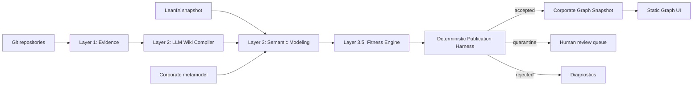

# Corporate Architecture Twin MVP

MVP file-based que compila evidências de repositórios em um grafo corporativo rastreável. Claude Code coordena cartographers e mappers; código determinístico valida o metamodelo, executa architectural fitness functions e controla a publicação.

## Arquitetura



## Fontes de verdade

- GitHub/repositórios: implementação técnica.
- `catalog/factsheets.json`: identidade e classificação corporativa exportadas do LeanIX.
- `config/metamodel.json`: tipos de nó.
- `config/relationship-policy.json`: relações permitidas.
- `fitness/definitions/`: políticas arquiteturais executáveis.
- `fitness/waivers/`: exceções temporárias aprovadas.
- `dist/graph/graph.json`: projeção compilada; nunca é editada manualmente.

## Preparação

```bash
python3 -m venv .venv
source .venv/bin/activate
pip install -r requirements.txt
```

Preencha:

- `config/repositories.json` com os caminhos dos clones locais;
- `catalog/factsheets.json` com o snapshot governado do LeanIX;
- `workspace/proposals/nodes/` e `workspace/proposals/relationships/` por meio dos agentes das layers 1–3.

## Fitness functions

A regra é definida uma vez em YAML/JSON e possui cinco dimensões independentes:

```yaml
spec:
  target:
    nodeTypes: [Application]
  evaluation:
    phase: GRAPH
    evaluatorType: GRAPH_QUERY
    query: {}
  policy:
    severity: HIGH
    enforcement: QUARANTINE
    onUnknown: QUARANTINE
  result:
    violationType: METAMODEL_INTEGRITY
    remediation:
      description: Corrija o mapeamento corporativo.
```

### Fases

- `EVIDENCE`: código, IaC, contratos e pipelines.
- `SEMANTIC`: campos, lifecycle, ownership e classificação.
- `GRAPH`: cardinalidade, relações proibidas e ciclos.
- `RUNTIME`: métricas, SLOs e freshness.
- `DOCUMENTATION`: reservado para políticas documentais.
- `COMPOSITE`: combina resultados de outras funções.

### Evaluators implementados

| Evaluator | Uso no MVP |
|---|---|
| `SEMANTIC_ASSERTION` / `STATIC_ASSERTION` | Assertions sobre campos e atributos dos nós |
| `GRAPH_QUERY` | `relationshipCardinality`, `forbiddenRelationship` e `acyclic` |
| `FILE_QUERY` / `IAC_POLICY` | Existência de arquivos e regex obrigatórias/proibidas |
| `SCHEMA_QUERY` | Assertions em documentos JSON/YAML como OpenAPI |
| `RUNTIME_THRESHOLD` | Comparação de métricas numéricas e freshness |
| `COMPOSITE` | `allOf` e `anyOf` de outras fitness functions |
| `LLM_ASSISTED` | Retorna `UNKNOWN`; exige confirmação determinística ou humana |

### Estados de avaliação

`PASS`, `FAIL`, `UNKNOWN`, `NOT_APPLICABLE`, `ERROR`, `STALE` e `WAIVED`.

### Enforcement

- `BLOCK`: impede a publicação e rejeita o alvo.
- `QUARANTINE`: retira o alvo do snapshot aceito.
- `WARN`: publica e registra violação.
- `ADVISORY`: recomendação não bloqueante.
- `OBSERVE`: mede sem alterar decisão.
- `onUnknown` define o comportamento para `UNKNOWN` e `STALE`.

### Comandos

```bash
python3 scripts/fitness_engine.py validate-definitions
python3 scripts/fitness_engine.py evaluate --graph dist/graph/graph.json
python3 scripts/fitness_engine.py evaluate --graph dist/graph/graph.json --phase RUNTIME
python3 -m unittest discover -s tests -v
```

O harness executa por padrão `SEMANTIC`, `GRAPH` e `COMPOSITE`, conforme `config/fitness-policy.json`:

```bash
python3 scripts/harness.py validate
python3 scripts/harness.py check
python3 scripts/harness.py publish
```

Resultados:

- `workspace/harness/fitness-results.json`
- `workspace/harness/diagnostics.json`
- `workspace/harness/accepted.json`
- `workspace/harness/quarantine.json`
- `workspace/harness/rejected.json`
- `dist/graph/graph.json`
- `dist/graph/diff.json`

## Waivers

Copie `fitness/examples/architecture-waiver.example.yaml` para `fitness/waivers/` e ajuste função, alvo, justificativa, aprovador, ADR e validade. Um waiver:

- somente se aplica a `FAIL`;
- precisa estar dentro da validade;
- não elimina a violação, apenas altera o estado para `WAIVED`;
- é materializado no grafo como `ArchitectureWaiver`.

## Nós de conformidade no grafo

- `FitnessFunction`: regra permanente e versionada.
- `FitnessViolation`: ocorrência ativa ou dispensada.
- `ArchitectureWaiver`: exceção formal e temporária.

Relações principais: `APPLIES_TO`, `INSTANCE_OF`, `AFFECTS` e `WAIVES`.

## Agentes Claude Code

Use, por exemplo:

```text
@fitness-dsl-author crie uma regra que bloqueie aplicações TARGET usando tecnologias END_OF_LIFE.
@fitness-orchestrator valide as definições e execute as fases SEMANTIC, GRAPH e COMPOSITE.
@waiver-validator revise os waivers ativos e os que expiram nos próximos 30 dias.
```

As definições executáveis ficam em `.claude/agents/*.md`. O hook em `.claude/settings.json` bloqueia escrita direta em artefatos compilados e governados.

## UI estática

```bash
python3 scripts/harness.py publish
python3 -m http.server 8080
```

Abra `http://localhost:8080/site/`. A UI mostra nós, relações e avaliações de fitness presentes no snapshot.

## Estrutura principal

```text
.
├── .claude/agents/
├── catalog/factsheets.json
├── config/
│   ├── fitness-policy.json
│   ├── metamodel.json
│   ├── relationship-policy.json
│   ├── repositories.json
│   └── views.json
├── fitness/
│   ├── definitions/
│   ├── examples/
│   └── waivers/
├── schemas/fitness/
├── scripts/
│   ├── fitness_engine.py
│   ├── guard_paths.py
│   └── harness.py
├── tests/
├── workspace/
├── dist/graph/
└── site/
```

## Fora do MVP

- banco de dados de grafo;
- execução distribuída ou streaming;
- sincronização bidirecional automática com LeanIX;
- parser AST específico para todas as linguagens;
- OPA/Checkov/Semgrep como dependências obrigatórias;
- aprovação automática de waivers;
- edição manual do grafo pela UI.
